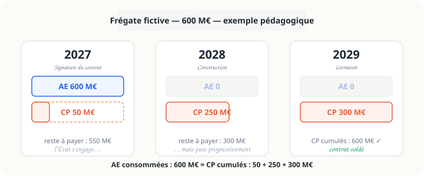

<p class="section-label">Défense & LPM · Fiche 03</p>

# Autorisations d'engagement et crédits de paiement

<p class="page-tagline">S'engager et payer : deux actes distincts.</p>
<p class="page-intro">Cette fiche sépare la notion, l'exemple, l'utilité pratique et le sujet des restes à payer. L'idée est d'accéder vite à la bonne vue sans dérouler toute la page.</p>

<nav class="local-nav">
  <a href="#vue-densemble">Vue d'ensemble</a>
  <a href="#explorer-ae-cp">Explorer</a>
  <a href="#repere-cle">Repère</a>
  <a href="#sources-pour-aller-plus-loin">Sources</a>
</nav>

## Vue d'ensemble {#vue-densemble}

```{=html}
<div class="overview-grid">
  <article class="overview-card">
    <span class="overview-kicker">Intuition</span>
    <strong class="overview-title">AE vs CP</strong>
    <span class="overview-desc">Jusqu'où l'État peut-il signer ? Combien peut-il payer cette année ?</span>
  </article>
  <article class="overview-card">
    <span class="overview-kicker">Exemple</span>
    <strong class="overview-title">Frégate fictive</strong>
    <span class="overview-desc">Une commande de 600 M€ étalée sur trois exercices.</span>
  </article>
  <article class="overview-card">
    <span class="overview-kicker">Usage</span>
    <strong class="overview-title">Pourquoi c'est utile</strong>
    <span class="overview-desc">La défense a besoin d'engager sur le long terme sans tout payer immédiatement.</span>
  </article>
  <article class="overview-card">
    <span class="overview-kicker">Suivi</span>
    <strong class="overview-title">Restes à payer</strong>
    <span class="overview-desc">L'écart entre AE consommées et CP déjà payés.</span>
  </article>
</div>
```

## Explorer AE / CP {#explorer-ae-cp}

::: {.panel-tabset #aecp-tabs}

## AE vs CP

```{=html}
<div class="versus">
  <div class="vs-left">
    <span style="font-size:1.5rem">📋</span><br>
    <strong style="color:var(--blue)">AE</strong><br>
    <em>Autorisation d'engagement</em><br><br>
    Plafond d'engagement juridique<br>
    Combien l'État peut-il signer ?
  </div>
  <div class="vs-divider">≠</div>
  <div class="vs-right">
    <span style="font-size:1.5rem">💶</span><br>
    <strong style="color:var(--coral)">CP</strong><br>
    <em>Crédit de paiement</em><br><br>
    Plafond de paiement effectif<br>
    Combien l'État peut-il décaisser cette année ?
  </div>
</div>
```

::: {.concept}
::: {.concept-label}
LOLF, art. 8
:::
Les **AE** limitent les dépenses pouvant être juridiquement engagées. Les **CP** limitent les dépenses pouvant être ordonnancées ou payées pendant l'année.
:::

## Frégate

> ⚠️ **Exemple pédagogique fictif.** Chiffres et dates inventés pour illustrer le mécanisme.

::: {.diagram-container}
{width="100%" alt="Tableau des flux AE et CP sur trois ans pour une frégate fictive de 600 millions d'euros"}
:::

::: {.diagram-caption}
Une seule signature peut générer des paiements échelonnés pendant plusieurs années.
:::

```{=html}
<div class="fregate-timeline">
  <div class="fregate-step">
    <div class="fregate-year">2027</div>
    <div class="fregate-dot" style="background:var(--blue)"></div>
    <div class="fregate-action">Signature</div>
    <div class="fregate-ae">AE : 600 M€</div>
    <div class="fregate-cp">CP : 50 M€</div>
  </div>
  <div class="fregate-step">
    <div class="fregate-year">2028</div>
    <div class="fregate-dot" style="background:var(--text-muted)"></div>
    <div class="fregate-action">Construction</div>
    <div class="fregate-ae">AE : —</div>
    <div class="fregate-cp">CP : 250 M€</div>
  </div>
  <div class="fregate-step">
    <div class="fregate-year">2029</div>
    <div class="fregate-dot" style="background:var(--coral)"></div>
    <div class="fregate-action">Livraison</div>
    <div class="fregate-ae">AE : —</div>
    <div class="fregate-cp">CP : 300 M€</div>
  </div>
</div>
```

<details>
<summary>Voir l'année par année</summary>

- **Année 1** : le contrat est signé, donc l'AE de 600 M€ est consommée ; seuls 50 M€ sont payés.
- **Année 2** : pas de nouvelle AE pour ce contrat ; 250 M€ sont payés.
- **Année 3** : toujours pas de nouvelle AE ; le solde de 300 M€ est payé.

</details>

## Pourquoi c'est utile

La distinction AE/CP permet à l'État de **s'engager sur la durée** tout en gardant la maîtrise des paiements annuels.

::: {.remember}
Sans AE/CP, l'État devrait disposer immédiatement de toute la trésorerie pour signer un contrat long, ce qui rendrait la gestion des grands programmes d'armement beaucoup plus rigide.
:::

::: {.warning}
::: {.warning-label}
À ne pas limiter à la défense
:::
Le mécanisme AE/CP vaut pour l'ensemble des ministères hors dépenses de personnel. Il est simplement **très visible** en défense à cause des programmes industriels pluriannuels.
:::

## Restes à payer

Quand les AE ont été consommées mais que tous les CP n'ont pas encore été versés, il subsiste des **restes à payer**.

::: {.concept}
::: {.concept-label}
Lecture rapide
:::
Les restes à payer mesurent les **engagements futurs déjà pris** par l'État.
:::

<details>
<summary>Pourquoi cet indicateur compte</summary>

Dans la Mission Défense, le niveau des restes à payer éclaire le poids des contrats déjà signés et des paiements qui devront être couverts dans les exercices futurs.

</details>

:::

## Repère clé {#repere-cle}

```{=html}
<div class="intro-quote">
  ENGAGEMENT ≠ PAIEMENT IMMÉDIAT
</div>
```

## Sources & pour aller plus loin {#sources-pour-aller-plus-loin}

```{=html}
<div class="source-grid">
  <article class="source-card">
    <span class="source-type">📜</span>
    <div class="source-body">
      <strong class="source-title">LOLF, art. 8 — Définition des AE et CP</strong>
      <p class="source-inst">Légifrance</p>
      <a href="https://www.legifrance.gouv.fr/loda/id/JORFTEXT000000394028/" class="source-link">Consulter sur Légifrance ↗</a>
    </div>
  </article>

  <article class="source-card">
    <span class="source-type">📊</span>
    <div class="source-body">
      <strong class="source-title">Rapport de la Cour des comptes sur le budget de la Défense</strong>
      <p class="source-inst">Cour des comptes</p>
      <a href="https://www.ccomptes.fr/fr/publications/le-budget-et-les-comptes-de-letat" class="source-link">Consulter ccomptes.fr ↗</a>
    </div>
  </article>

  <article class="source-card">
    <span class="source-type">📘</span>
    <div class="source-body">
      <strong class="source-title">Le guide pratique de la LOLF — Direction du Budget</strong>
      <p class="source-inst">budget.gouv.fr</p>
      <a href="https://www.budget.gouv.fr/documentation/le-budget-de-letat/la-lolf" class="source-link">Consulter budget.gouv.fr ↗</a>
    </div>
  </article>
</div>
```

---

::: {.page-navigation}
::: {.nav-prev}
::: {.nav-label}
← Fiche précédente
:::
::: {.nav-title}
[La Mission Défense](mission-defense.html)
:::
:::

::: {.nav-next}
::: {.nav-label}
Section suivante →
:::
::: {.nav-title}
[Europe — Dépenses nettes](../europe/index.html)
:::
:::
:::
