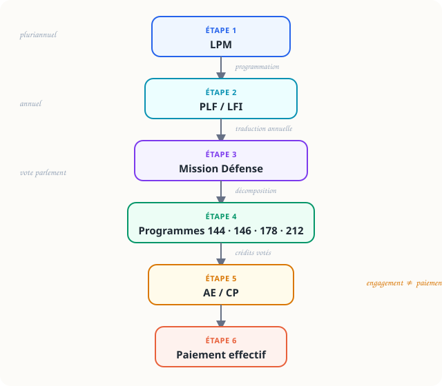

<p class="section-label">Section 02</p>

# Défense & LPM

<p class="page-tagline">De la programmation militaire au paiement d'une frégate : suivre le chemin de l'argent.</p>

---

Comprendre le financement de la Défense, c'est comprendre comment une **intention politique pluriannuelle** — la loi de programmation militaire — se traduit, étape par étape, en **crédits budgétaires annuels**, puis en **engagements juridiques**, puis en **paiements effectifs**.

Ce chemin est le cœur de cette section.

## Le chemin de l'argent

::: {.diagram-container}
{width="100%" alt="Schéma du chemin de l'argent : LPM, puis loi de finances annuelle, puis Mission Défense, puis programmes, puis AE/CP, puis paiement"}
:::

::: {.diagram-caption}
De la programmation pluriannuelle au paiement — six étapes clés
:::

## Dans cette section

```{=html}
<div class="entry-cards" style="grid-template-columns: repeat(auto-fill, minmax(260px,1fr))">

  <a href="lpm.html" class="entry-card card-blue" style="text-decoration:none">
    <div class="card-title">La LPM 2024–2030</div>
    <div class="card-desc">
      Qu'est-ce qu'une loi de programmation militaire ? Comment se distingue-t-elle d'une loi de finances annuelle ?
    </div>
    <div class="card-tags">
      <span class="card-tag">LPM</span>
      <span class="card-tag">Programmation</span>
      <span class="card-tag">Pluriannuel</span>
    </div>
  </a>

  <a href="mission-defense.html" class="entry-card card-coral" style="text-decoration:none">
    <div class="card-title">La Mission Défense</div>
    <div class="card-desc">
      Les quatre programmes : 144 (Anticiper), 146 (Équiper), 178 (Agir), 212 (Soutenir).
    </div>
    <div class="card-tags">
      <span class="card-tag">P144</span>
      <span class="card-tag">P146</span>
      <span class="card-tag">P178</span>
      <span class="card-tag">P212</span>
    </div>
  </a>

  <a href="ae-cp.html" class="entry-card card-yellow" style="text-decoration:none">
    <div class="card-title">AE et CP</div>
    <div class="card-desc">
      Autorisations d'engagement et crédits de paiement — comprendre la différence en moins de cinq minutes, avec l'exemple de la frégate.
    </div>
    <div class="card-tags">
      <span class="card-tag">AE</span>
      <span class="card-tag">CP</span>
      <span class="card-tag">Engagement</span>
    </div>
  </a>

</div>
```

## Idée clé

::: {.remember}
La LPM **n'est pas un chèque**. Elle fixe un cadre pluriannuel. Mais chaque euro ne devient disponible qu'après être inscrit en loi de finances annuelle et voté par le Parlement.
:::

---

[Commencer par la LPM →](lpm.html)
