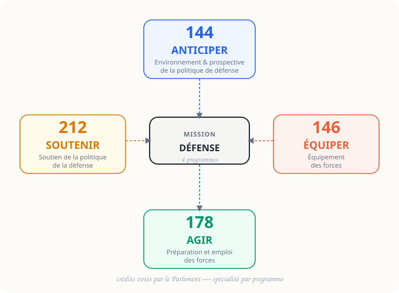

<p class="section-label">Défense & LPM · Fiche 02</p>

# La Mission Défense

<p class="page-tagline">Quatre programmes. Quatre logiques. Une consultation à la carte.</p>
<p class="page-intro">Le budget de la Défense se lit beaucoup mieux programme par programme. Utilisez les cartes et les onglets pour aller directement vers la fonction qui vous intéresse.</p>

<nav class="local-nav">
  <a href="#vue-densemble">Vue d'ensemble</a>
  <a href="#explorer-les-programmes">Programmes</a>
  <a href="#point-de-gestion">Gestion</a>
  <a href="#sources-pour-aller-plus-loin">Sources</a>
</nav>

## Vue d'ensemble {#vue-densemble}

::: {.diagram-container}
{width="100%" alt="Schéma de la Mission Défense avec ses quatre programmes : 144 Anticiper, 146 Équiper, 178 Agir, 212 Soutenir"}
:::

::: {.diagram-caption}
Quatre programmes pour répartir les moyens entre anticipation, équipement, emploi et soutien.
:::

```{=html}
<div class="overview-grid">
  <button type="button" class="overview-card" data-tabset-target="mission-tabs" data-tab-target="P144">
    <span class="overview-kicker">Anticiper</span>
    <strong class="overview-title">Programme 144</strong>
    <span class="overview-desc">Renseignement, prospective, innovation et compréhension stratégique.</span>
  </button>
  <button type="button" class="overview-card" data-tabset-target="mission-tabs" data-tab-target="P146">
    <span class="overview-kicker">Équiper</span>
    <strong class="overview-title">Programme 146</strong>
    <span class="overview-desc">Programmes d'armement, DGA et grands engagements industriels.</span>
  </button>
  <button type="button" class="overview-card" data-tabset-target="mission-tabs" data-tab-target="P178">
    <span class="overview-kicker">Agir</span>
    <strong class="overview-title">Programme 178</strong>
    <span class="overview-desc">Préparation opérationnelle, activité des forces et conduite des opérations.</span>
  </button>
  <button type="button" class="overview-card" data-tabset-target="mission-tabs" data-tab-target="P212">
    <span class="overview-kicker">Soutenir</span>
    <strong class="overview-title">Programme 212</strong>
    <span class="overview-desc">Ressources humaines, immobilier, SI et fonctions transversales.</span>
  </button>
  <button type="button" class="overview-card" data-tabset-target="mission-tabs" data-tab-target="Gestion">
    <span class="overview-kicker">Cadre</span>
    <strong class="overview-title">Règles de gestion</strong>
    <span class="overview-desc">Mouvements de crédits et limites à ne pas simplifier.</span>
  </button>
</div>
```

## Explorer les programmes {#explorer-les-programmes}

```{=html}
<div class="segmented-control">
  <button type="button" data-tabset-target="mission-tabs" data-tab-target="P144">P144</button>
  <button type="button" data-tabset-target="mission-tabs" data-tab-target="P146">P146</button>
  <button type="button" data-tabset-target="mission-tabs" data-tab-target="P178">P178</button>
  <button type="button" data-tabset-target="mission-tabs" data-tab-target="P212">P212</button>
  <button type="button" data-tabset-target="mission-tabs" data-tab-target="Gestion">Gestion</button>
</div>
```

::: {.panel-tabset #mission-tabs}

## P144

Le programme 144 finance ce qui permet de **voir venir** : renseignement, prospective stratégique, innovation, relations internationales de défense.

::: {.example}
::: {.example-label}
Exemple
:::
Les études sur des technologies de rupture ou l'analyse de long terme de l'environnement stratégique relèvent de cette logique d'anticipation.
:::

::: {.remember}
Question à se poser : **comment la France comprend-elle et prépare-t-elle l'avenir ?**
:::

## P146

Le programme 146 concentre la logique **équipement / armement** : acquisition, développement et contractualisation des capacités militaires.

::: {.concept}
::: {.concept-label}
Point central
:::
La **DGA** y joue un rôle clé. C'est ici que l'on voit le plus nettement les grands montants en **AE**, car les contrats sont pluriannuels.
:::

::: {.example}
::: {.example-label}
Exemples typiques
:::
Rafale, SNLE, frégates, véhicules SCORPION, dissuasion et autres grands programmes capacitaires.
:::

## P178

Le programme 178 finance l'**emploi concret des forces** : entraînement, préparation opérationnelle, activité, disponibilité des matériels, conduite des opérations.

::: {.example}
::: {.example-label}
Indicateurs parlants
:::
Heures de vol, journées de mer, taux de disponibilité, activité des forces terrestres.
:::

::: {.remember}
Question à se poser : **les armées sont-elles capables d'agir réellement, ici et maintenant ?**
:::

## P212

Le programme 212 assure les fonctions de **soutien et de structure** du ministère : RH, immobilier, systèmes d'information, fonctions juridiques et administratives.

::: {.example}
::: {.example-label}
Exemples
:::
Gestion du personnel civil, infrastructures immobilières, SI ministériels, fonctions transversales de fonctionnement.
:::

::: {.remember}
Sans le P212, les autres programmes disposent de moyens mais pas de **socle administratif et humain** pour fonctionner.
:::

## Gestion

Les programmes ne sont pas des blocs totalement hermétiques, mais ils ne sont pas non plus librement fongibles.

::: {.warning}
::: {.warning-label}
Ne pas simplifier à l'excès
:::
La LOLF prévoit des **virements**, **transferts** et, dans certains cas, des **décrets d'avance**. Ces mouvements sont encadrés et n'effacent pas la logique de spécialité.
:::

<details>
<summary>Voir les trois mécanismes à retenir</summary>

- **Virement** : entre programmes d'un même ministère
- **Transfert** : entre ministères différents
- **Décret d'avance** : abondement en urgence dans un cadre légal précis

</details>

:::

## Point de gestion {#point-de-gestion}

::: {.question-card}
::: {.question-text}
Pour lire vite la Mission Défense, demandez-vous d'abord si vous êtes face à un besoin d'**anticipation**, d'**équipement**, d'**emploi** ou de **soutien**.
:::
:::

## Sources & pour aller plus loin {#sources-pour-aller-plus-loin}

```{=html}
<div class="source-grid">
  <article class="source-card">
    <span class="source-type">🛡️</span>
    <div class="source-body">
      <strong class="source-title">Projets annuels de performances (PAP) — Mission Défense</strong>
      <p class="source-inst">budget.gouv.fr / Ministère des Armées</p>
      <a href="https://www.budget.gouv.fr/documentation/documents-budgetaires/exercice-2024/les-annexes-au-projet-de-loi-de-finances/projet-annuel-de-performances" class="source-link">Consulter budget.gouv.fr ↗</a>
    </div>
  </article>

  <article class="source-card">
    <span class="source-type">📜</span>
    <div class="source-body">
      <strong class="source-title">LOLF — Articles 7 et suivants (structure en missions et programmes)</strong>
      <p class="source-inst">Légifrance</p>
      <a href="https://www.legifrance.gouv.fr/loda/id/JORFTEXT000000394028/" class="source-link">Consulter sur Légifrance ↗</a>
    </div>
  </article>
</div>
```

---

::: {.page-navigation}
::: {.nav-prev}
::: {.nav-label}
← Fiche précédente
:::
::: {.nav-title}
[La LPM 2024–2030](lpm.html)
:::
:::

::: {.nav-next}
::: {.nav-label}
Fiche suivante →
:::
::: {.nav-title}
[AE et CP](ae-cp.html)
:::
:::
:::
