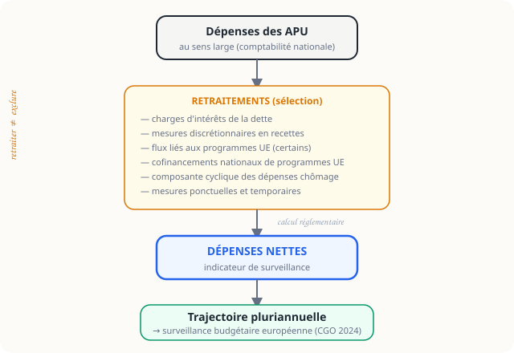

<p class="section-label">Europe · Fiche 01</p>

# Les dépenses nettes

<p class="page-tagline">Le nouvel indicateur central de la surveillance budgétaire européenne.</p>
<p class="page-intro">Cette fiche sépare le pourquoi, le calcul, la comparaison avec les autres indicateurs et le cas français. L'objectif est de consulter vite la bonne couche d'information.</p>

<nav class="local-nav">
  <a href="#vue-densemble">Vue d'ensemble</a>
  <a href="#explorer-lindicateur">Explorer</a>
  <a href="#repere-europeen">Repère</a>
  <a href="#sources-pour-aller-plus-loin">Sources</a>
</nav>

## Vue d'ensemble {#vue-densemble}

```{=html}
<div class="overview-grid">
  <article class="overview-card">
    <span class="overview-kicker">Intérêt</span>
    <strong class="overview-title">Pourquoi ?</strong>
    <span class="overview-desc">Isoler ce que le gouvernement décide réellement, au-delà du seul déficit.</span>
  </article>
  <article class="overview-card">
    <span class="overview-kicker">Méthode</span>
    <strong class="overview-title">Calcul</strong>
    <span class="overview-desc">Partir des dépenses publiques puis appliquer des retraitements réglementaires.</span>
  </article>
  <article class="overview-card">
    <span class="overview-kicker">Lecture</span>
    <strong class="overview-title">Comparaison</strong>
    <span class="overview-desc">Situer les dépenses nettes face au déficit, à la dette et au solde structurel.</span>
  </article>
  <article class="overview-card">
    <span class="overview-kicker">Application</span>
    <strong class="overview-title">France et règles</strong>
    <span class="overview-desc">Comprendre ce qui change depuis 2024 sans croire que les seuils de Maastricht ont disparu.</span>
  </article>
</div>
```

## Explorer l'indicateur {#explorer-lindicateur}

::: {.panel-tabset #depenses-tabs}

## Pourquoi

Le déficit public est utile, mais il varie aussi sous l'effet du **cycle économique**. Les dépenses nettes cherchent à mieux capter l'**action discrétionnaire** du gouvernement.

::: {.remember}
L'idée n'est pas de remplacer toute lecture budgétaire, mais de privilégier un indicateur plus stable pour la surveillance pluriannuelle.
:::

::: {.concept}
::: {.concept-label}
Cadre réglementaire
:::
La réforme entrée en vigueur en **2024** repose notamment sur les règlements **(UE) 2024/1263** et **(UE) 2024/1264**.
:::

## Calcul

Les dépenses nettes partent des **dépenses des administrations publiques** puis neutralisent plusieurs éléments prévus par le règlement.

::: {.diagram-container}
{width="100%" alt="Schéma illustrant les étapes de calcul des dépenses nettes : dépenses APU, retraitements, dépenses nettes, trajectoire, surveillance européenne"}
:::

```{=html}
<div class="retraitement-list">
  <div class="retraitement-item">
    <div class="retraitement-number">1</div>
    <div class="retraitement-body"><strong>Charges d'intérêts</strong> — exclues car elles reflètent surtout la dette héritée.</div>
  </div>
  <div class="retraitement-item">
    <div class="retraitement-number">2</div>
    <div class="retraitement-body"><strong>Mesures discrétionnaires en recettes</strong> — intégrées pour tenir compte des décisions fiscales.</div>
  </div>
</div>
```

<details class="retraitement-details">
<summary>Voir les autres retraitements</summary>

- flux liés à certains **programmes de l'Union européenne** ;
- **composante cyclique du chômage** ;
- **mesures ponctuelles et temporaires** non reconductibles.

</details>

## Comparaison

```{=html}
<div class="entry-cards" style="grid-template-columns: repeat(auto-fit, minmax(200px,1fr))">
  <div class="entry-card" style="cursor:default;border-color:var(--coral)">
    <div class="card-title" style="color:var(--coral)">Déficit public</div>
    <div class="card-desc">Photographie recettes moins dépenses, très sensible au cycle. Seuil : 3 % du PIB.</div>
  </div>
  <div class="entry-card" style="cursor:default;border-color:var(--yellow)">
    <div class="card-title" style="color:var(--yellow)">Dette publique</div>
    <div class="card-desc">Stock accumulé des déficits passés. Seuil : 60 % du PIB.</div>
  </div>
  <div class="entry-card" style="cursor:default;border-color:var(--violet)">
    <div class="card-title" style="color:var(--violet)">Solde structurel</div>
    <div class="card-desc">Déficit corrigé du cycle économique, utile mais plus technique.</div>
  </div>
  <div class="entry-card" style="cursor:default;border-color:var(--blue)">
    <div class="card-title" style="color:var(--blue)">Dépenses nettes</div>
    <div class="card-desc">Outil central de surveillance depuis 2024 pour piloter la trajectoire discrétionnaire.</div>
  </div>
</div>
```

::: {.remember}
Les dépenses nettes ne font pas disparaître les autres indicateurs : elles déplacent le **centre de gravité** de la surveillance.
:::

## France et règles

Les seuils de **3 %** et **60 %** n'ont pas disparu. Ce qui change, c'est la manière normale de suivre l'ajustement pluriannuel.

::: {.warning}
::: {.warning-label}
À éviter
:::
Présenter la réforme de 2024 comme un abandon de Maastricht serait inexact. Le nouveau cadre conserve les seuils de référence tout en mettant en avant la trajectoire de dépenses nettes.
:::

<details>
<summary>Voir le point spécifique pour la France</summary>

La trajectoire française doit être vérifiée dans les documents les plus récents de la **Commission européenne**, du **Conseil de l'UE** et de la **Direction du Budget**. Les chiffres détaillés ne sont pas reproduits ici pour éviter l'obsolescence.

</details>

:::

## Repère européen {#repere-europeen}

::: {.question-card}
::: {.question-text}
La bonne question n'est plus seulement « quel est le déficit ? » mais aussi : **quelle trajectoire discrétionnaire de dépenses l'État s'est-il engagée à suivre ?**
:::
:::

## Sources & pour aller plus loin {#sources-pour-aller-plus-loin}

```{=html}
<div class="source-grid">
  <article class="source-card">
    <span class="source-type">🇪🇺</span>
    <div class="source-body">
      <strong class="source-title">Règlement (UE) 2024/1263 du 29 avril 2024 — gouvernance économique européenne</strong>
      <p class="source-inst">EUR-Lex / Parlement européen et Conseil</p>
      <a href="https://eur-lex.europa.eu/legal-content/FR/TXT/?uri=CELEX:32024R1263" class="source-link">Consulter sur EUR-Lex ↗</a>
    </div>
  </article>

  <article class="source-card">
    <span class="source-type">🇪🇺</span>
    <div class="source-body">
      <strong class="source-title">Règlement (UE) 2024/1264 du 29 avril 2024 — procédure de déficit excessif</strong>
      <p class="source-inst">EUR-Lex / Conseil de l'Union européenne</p>
      <a href="https://eur-lex.europa.eu/legal-content/FR/TXT/?uri=CELEX:32024R1264" class="source-link">Consulter sur EUR-Lex ↗</a>
    </div>
  </article>

  <article class="source-card">
    <span class="source-type">📊</span>
    <div class="source-body">
      <strong class="source-title">Surveillance budgétaire européenne — Commission européenne</strong>
      <p class="source-inst">Commission européenne</p>
      <a href="https://ec.europa.eu/info/business-economy-euro/economic-and-fiscal-policy-coordination/eu-economic-governance-monitoring-prevention-correction_fr" class="source-link">Consulter ec.europa.eu ↗</a>
    </div>
  </article>
</div>
```

---

::: {.page-navigation}
::: {.nav-prev}
::: {.nav-label}
← Section précédente
:::
::: {.nav-title}
[AE et CP — Défense](../defense/ae-cp.html)
:::
:::

::: {.nav-next}
::: {.nav-label}
Référence →
:::
::: {.nav-title}
[Glossaire](../glossaire.html)
:::
:::
:::
