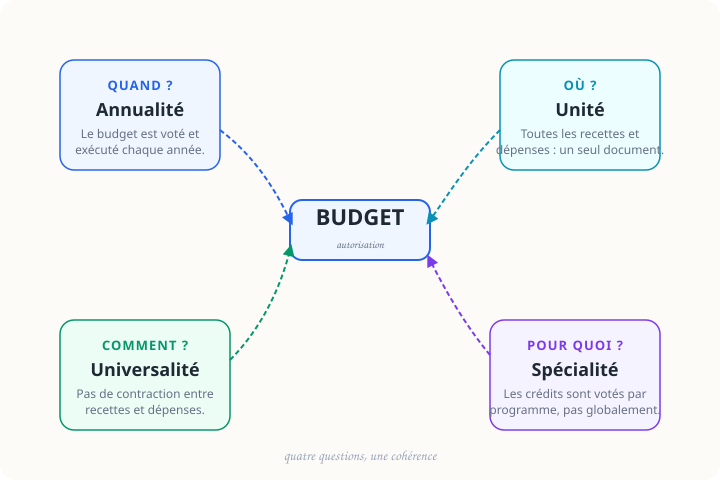

<p class="section-label">Fondamentaux · Fiche 01</p>

# Les quatre principes budgétaires

<p class="page-tagline">Quatre questions. Quatre vues. Une seule logique.</p>
<p class="page-intro">Cette fiche se consulte comme un tableau de bord : choisir la question utile, ouvrir le principe correspondant, puis déplier seulement les détails nécessaires.</p>

<nav class="local-nav">
  <a href="#vue-densemble">Vue d'ensemble</a>
  <a href="#explorer-les-principes">Explorer</a>
  <a href="#repere-rapide">Repère rapide</a>
  <a href="#sources-pour-aller-plus-loin">Sources</a>
</nav>

## Vue d'ensemble {#vue-densemble}

Choisissez d'abord la question à laquelle vous voulez répondre.

```{=html}
<div class="overview-grid">
  <button type="button" class="overview-card" data-tabset-target="principes-tabs" data-tab-target="Annualité">
    <span class="overview-kicker">Quand ?</span>
    <strong class="overview-title">Annualité</strong>
    <span class="overview-desc">L'autorisation parlementaire vaut pour un exercice déterminé.</span>
  </button>
  <button type="button" class="overview-card" data-tabset-target="principes-tabs" data-tab-target="Unité">
    <span class="overview-kicker">Où ?</span>
    <strong class="overview-title">Unité</strong>
    <span class="overview-desc">Toutes les recettes et dépenses doivent apparaître dans la loi de finances.</span>
  </button>
  <button type="button" class="overview-card" data-tabset-target="principes-tabs" data-tab-target="Universalité">
    <span class="overview-kicker">Comment ?</span>
    <strong class="overview-title">Universalité</strong>
    <span class="overview-desc">On présente les flux pour leur montant brut, sans les masquer.</span>
  </button>
  <button type="button" class="overview-card" data-tabset-target="principes-tabs" data-tab-target="Spécialité">
    <span class="overview-kicker">Pour quoi ?</span>
    <strong class="overview-title">Spécialité</strong>
    <span class="overview-desc">Les crédits sont votés pour une finalité précise, pas pour un usage libre.</span>
  </button>
</div>
```

## Explorer les principes {#explorer-les-principes}

```{=html}
<div class="segmented-control">
  <button type="button" data-tabset-target="principes-tabs" data-tab-target="Annualité">Annualité</button>
  <button type="button" data-tabset-target="principes-tabs" data-tab-target="Unité">Unité</button>
  <button type="button" data-tabset-target="principes-tabs" data-tab-target="Universalité">Universalité</button>
  <button type="button" data-tabset-target="principes-tabs" data-tab-target="Spécialité">Spécialité</button>
</div>
```

::: {.panel-tabset #principes-tabs}

## Annualité

L'autorisation budgétaire est **temporaire** : le Parlement vote pour l'année civile, pas pour une durée indéfinie.

::: {.concept}
::: {.concept-label}
Définition
:::
Les crédits ouverts en loi de finances valent en principe du **1er janvier au 31 décembre**. En fin d'exercice, les crédits non consommés sont annulés sauf mécanisme légal contraire.
:::

::: {.example}
::: {.example-label}
Exemple
:::
Si 100 M€ sont votés pour l'université en année N, ces crédits ne valent pas automatiquement en année N+1. Une nouvelle loi de finances doit reprendre l'autorisation.
:::

::: {.remember}
L'annualité protège le **contrôle démocratique régulier** du Parlement : chaque année, l'autorisation est rediscutée.
:::

<details>
<summary>Voir les aménagements utiles</summary>

- Les **AE** permettent d'engager un contrat pluriannuel.
- Les **CP** restent votés et consommés année par année.
- Les **reports de crédits** existent mais demeurent encadrés.

</details>

## Unité

Le budget doit rester **lisible d'un seul regard** : on ne disperse pas les dépenses de l'État dans des documents parallèles.

::: {.concept}
::: {.concept-label}
Définition
:::
Le principe d'unité impose que l'ensemble des recettes et des dépenses de l'État soit présenté dans la **loi de finances**, afin de garantir une vue d'ensemble au Parlement.
:::

::: {.example}
::: {.example-label}
Exemple
:::
Les 100 M€ d'une politique universitaire ne peuvent pas être cachés dans un document officieux séparé du budget général.
:::

::: {.remember}
L'unité vise la **transparence de présentation** : un budget éclaté empêche de juger l'ensemble des choix publics.
:::

<details>
<summary>Voir les exceptions prévues par la LOLF</summary>

- **Budgets annexes**
- **Comptes spéciaux**

Ces exceptions restent légales, limitées et soumises au vote du Parlement.

</details>

## Universalité

Le budget doit montrer les flux **dans leur intégralité** : on ne masque pas une dépense en la compensant avec une recette.

::: {.concept}
::: {.concept-label}
Définition
:::
L'universalité combine deux règles : **non-contraction** (pas de compensation entre recettes et dépenses) et **non-affectation** (une recette n'est pas, par principe, réservée à une dépense précise).
:::

::: {.example}
::: {.example-label}
Exemple
:::
Si une université perçoit des recettes propres, elles ne doivent pas être simplement déduites des dépenses présentées. Il faut montrer recettes et dépenses séparément.
:::

::: {.remember}
L'objectif est d'éviter une présentation **trop flatteuse ou incomplète** des finances publiques.
:::

<details>
<summary>Voir les principales dérogations</summary>

- Certains **comptes d'affectation spéciale** autorisent une affectation précise.
- Certaines opérations comptables admettent des exceptions de **non-contraction**.

</details>

## Spécialité

Le Parlement n'autorise pas « une grosse enveloppe ». Il autorise des crédits pour une **finalité définie**.

::: {.concept}
::: {.concept-label}
Définition (LOLF, art. 7)
:::
Les crédits sont spécialisés par **programme**. Ils ne peuvent pas, en principe, financer librement une autre politique sans mouvement de crédits autorisé.
:::

::: {.example}
::: {.example-label}
Exemple
:::
Des crédits votés pour la politique universitaire ne peuvent pas être redéployés vers la réparation d'une route sans base juridique adaptée.
:::

::: {.remember}
La spécialité donne au vote parlementaire un **sens concret** : l'autorisation porte sur un objet identifiable.
:::

<details>
<summary>Voir la souplesse réelle de gestion</summary>

La spécialité n'interdit pas tout ajustement. La LOLF autorise des **virements**, **transferts** et autres mouvements de crédits, mais dans un cadre contrôlé.

</details>

:::

## Repère rapide {#repere-rapide}

::: {.diagram-container}
{width="100%" alt="Schéma des quatre principes budgétaires : Annualité (QUAND ?), Unité (OÙ ?), Universalité (COMMENT ?), Spécialité (POUR QUOI ?)"}
:::

::: {.diagram-caption}
Un repère visuel pour retenir la bonne question avant de chercher le détail.
:::

::: {.remember}
Quand vous lisez un budget, posez toujours ces quatre questions dans cet ordre : **quand**, **où**, **comment**, **pour quoi**.
:::

## Sources & pour aller plus loin {#sources-pour-aller-plus-loin}

```{=html}
<div class="source-grid">
  <article class="source-card">
    <span class="source-type">📜</span>
    <div class="source-body">
      <strong class="source-title">Loi organique n° 2001-692 du 1er août 2001 relative aux lois de finances (LOLF)</strong>
      <p class="source-inst">Légifrance · 2001, modifiée en 2021</p>
      <a href="https://www.legifrance.gouv.fr/loda/id/JORFTEXT000000394028/" class="source-link">Consulter sur Légifrance ↗</a>
    </div>
  </article>

  <article class="source-card">
    <span class="source-type">📘</span>
    <div class="source-body">
      <strong class="source-title">Les finances publiques — Direction du Budget</strong>
      <p class="source-inst">budget.gouv.fr</p>
      <a href="https://www.budget.gouv.fr/documentation/le-budget-de-letat/les-fondamentaux" class="source-link">Consulter budget.gouv.fr ↗</a>
    </div>
  </article>

  <article class="source-card">
    <span class="source-type">🏛️</span>
    <div class="source-body">
      <strong class="source-title">Note d'information sur la LOLF — Assemblée nationale</strong>
      <p class="source-inst">Assemblée nationale</p>
      <a href="https://www.assemblee-nationale.fr/dyn/finances-publiques" class="source-link">Consulter assemblee-nationale.fr ↗</a>
    </div>
  </article>
</div>
```

---

::: {.page-navigation}
::: {.nav-prev}
::: {.nav-label}
← Section
:::
::: {.nav-title}
[Vue d'ensemble des fondamentaux](index.html)
:::
:::

::: {.nav-next}
::: {.nav-label}
Fiche suivante →
:::
::: {.nav-title}
[Architecture de la LOLF](architecture-lolf.html)
:::
:::
:::
